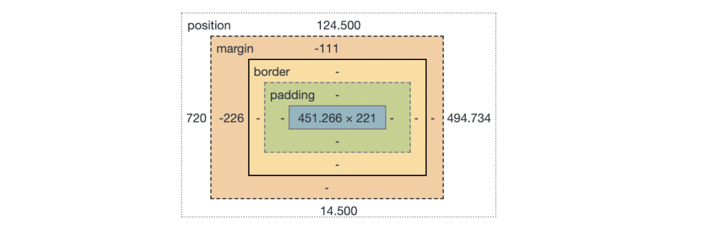

### 1. 배경화면에 이미지 넣을때 img 태그 사용하지 않는다. 

```
 
```

* 위와 같이 할 경우 배경화면에 스크롤이 생긴다. 

* css에서 크기를 조정할수도 있지만 이방법은 쓰진 않는다. 

  ```
  img { 
      width: 100%;
      height: 100%;
  }
  ```

* 배경화면에 스크롤없이 꽉찬 이미지를 넣고 싶다면 아래와 같이 사용해야한다. 

  ```
  	html 파일에서의 코드
  
  <div class="background__01"></div>
  ```

  ```
  css 파일에서의 코드 
  
  html, body {
      width: 100%;
      height: 100%;
  }
  .background__01 {
      background: url("../images/a.jpg") no-repeat; 
      width: 100%;
      height: 100%;
      background-position: center;
      background-size: cover;
  }
  ```

  

* 웹창의 크기와 상관없이 이미지가 자동으로 전체가 보여지길 원할때 background-size를 cover로 사용

  * f12 누른 후 콘솔화면에서 직접 여러가지 경우들 확인해보기

  ```
     background-position: center;
     background-size: cover;
  ```

### 2. 화면이 자동으로 슬라이드 되도록 할땐 bxslider 사용

* 크롬에서 bxslider 를 검색하여 example 에 나와있는데로 사용.

* options에 있는 것들 활용하여 슬라이드 되도록 함. 

  ```
  <!DOCTYPE html>
  <html>
     <head>
          <meta charset="utf-8">
          <title>샘플페이지</title>
          <link href = "css/reset.css" rel ="stylesheet" type="text/css" />
          <link href = "css/style.css" rel="stylesheet" type="text/css"/>    
          <script src="js/jquery.1.12.4.js" type="text/javascript"></script>
          <script src="plugins/bxslider/js/jquery.bxslider.js" type="text/javascript"></script>    
          <script>
              $(document).ready(function(){
                $('.slider').bxSlider({
                    controls:false,
                    pager:false,
                    auto:true
                });
              });
            </script>
            
      </head>
      <body>
         <div class ="slider">
          <div class="background__01"></div>
          <div class="background__02"></div>
          <div class="background__03"></div>
         </div>
      </body>
  </html>
  ```


### 3. 이미지 위에 다른 이미지 겹쳐줄 때

* Position, top을 이용하여 화면이 같은 위치에 있게 해준다. 
* z-index를 사용하여 같은 위치에 있는 이미지 중 위로 더 보이게 만들어주는 효과 가능. 0~9999까지 음수 양수 가능

```
.overlay {
    width: 100%;
    height: 100%;
    background: url("../images/16.png");
    position: absolute;
    top: 0;
    z-index: 10;
}	
```

### 4. Inline-block, border-radius

* 각각의 태그를 한줄에 일렬로 두고 싶을때 inline-block 사용
* 완전원형을 만들고 싶을때 border-radius 값을 50%로 만들어준다. 


### 5. Ul, li 태크사용하여 순서없는 4개의 버튼 값을 만들어준다. 

```
<div class="contents__sns">
          <ul class="contents__list">
            <li>
              <a href="#">
                <i>facebook</i>
              </a>
            </li>
            <li>
              <a href="#">
                <i>twitter</i>
              </a>
            </li>
            <li>
              <a href="#">
                <i>insta</i>
              </a>
            </li>
            <li>
              <a href="#">
                <i>blog</i>
              </a>
            </li>
          </ul>
        </div>
```

* 코드를 보기 쉽게 하기 위해 엔터를 치고 띄어쓰기하는 것이 실제 화면에서 태그들간의 여백을 만들어낸다
* 이것을 없애기 위해서 css에서 상위태그의 font-size를 0으로 해주고 하위 태크에 font-size의 가장 일반적인 값인 16px을 넣어준다. 

```
.contents__list {
    font-size: 0;
    line-height: 52px;
}
.contents__list >li {
    display : inline-block;
    width : 52px;
    height: 52px;
    border: white 1px solid;
    border-radius: 50%;
    font-size: 16px;
    margin-right: 20px;
}
```


### 6. font awesome 이라는 css library사용(무료)

* 파일 설치 또는 link로 바로 가져와서 사용가능

* 원하는 검색어 입력후 태그 가져와서 입력만 하면 사용가능

  ```
  <a href="#">
      <i class="fab fa-facebook-f"></i>
  </a>
  ```


### 7. 각각의 li 태그들 margin-right:20px을 준 후 마지막 태그에는 margin 값을 주지 않을 때 

* contents__list > Li: last-child {.  } 사용

```
.contents__list >li {
    display : inline-block;
    width : 52px;
    height: 52px;
    border: white 1px solid;
    border-radius: 50%;
    font-size: 16px;
    margin-right: 20px;
}
.contents__list>li:last-child{
    margin-right: 0;
```


### 8. contents div 태그를 페이지 한가운데에 두고 싶을때

* Top: 50%

  Left: 50% 값을 준후 검사 화면에서 contents의 넒이 높이를 확인후 2로 나눈값을 빼준다.



* 위와 같이 대략 가로 452px, 222px이므로 2로 나누면 226px, 111px이 된고 이를 margin-left : -226px, margin-top:-111px해서 빼준다.

  ```
  .contents {
      position: absolute;
      top: 50%;
      left: 50%;
      margin-left: -226px;
      margin-top: -111px;
      z-index: 20;
      text-align: center;
  }
  ```


### 9. href로 연동된 링크로 이동될때 새창으로 이동되도록 하고 싶을때

* a태그 안에 target="_blank"를 지정해준다. 

  ```
  <a href="https://www.instagram.com/ejshin2ya/" target="_blank">
      <i class="fab fa-instagram"></i>
  </a>
  ```

  